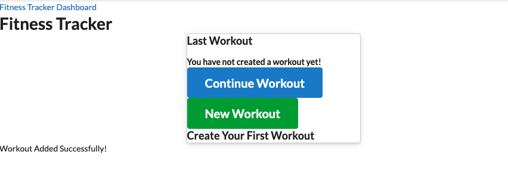

# fitness-tracker

## description
With this app, you are able to view, create and track daily workouts. You can log multiple exercises in a workout on a given day. You are also able to track the name, type, weight, sets, reps, and duration of exercise. If the exercise is a cardio exercise, I should be able to track my distance traveled.


<br>

DEPLOYED: [HERE ON HEROKU](https://whispering-beyond-13736.herokuapp.com/)
<br>
<br>

## Built With

* [Express](https://www.w3schools.com/)
* [MongoD](https://www.w3schools.com/)
* [Node](https://nodejs.org/)
* [Javascript](https://www.w3schools.com/)
* [Mongoose](https://mongoosejs.com/)

## Getting Started
To get a local copy up and running follow these simple steps. You can also download the source files provided. You will need a text editor such as Visual Studio Code, Xcode or similar to edit the source code.

## Installation
1. Clone the repo
   ```sh
   git clone https://github.com/justpeachy8688/fitness-tracker
   ```

2. Pull the latest
   ```sh
   git pull

## Contact

Taylor Sanders<br>
https://github.com/justpeachy8688